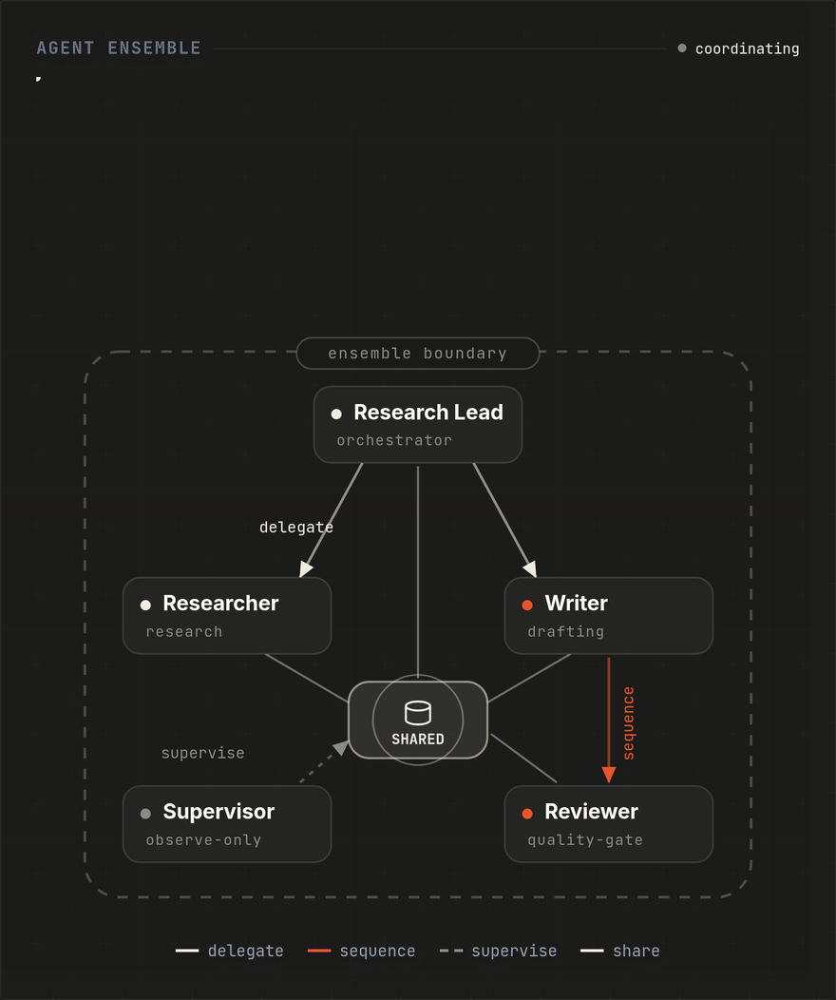
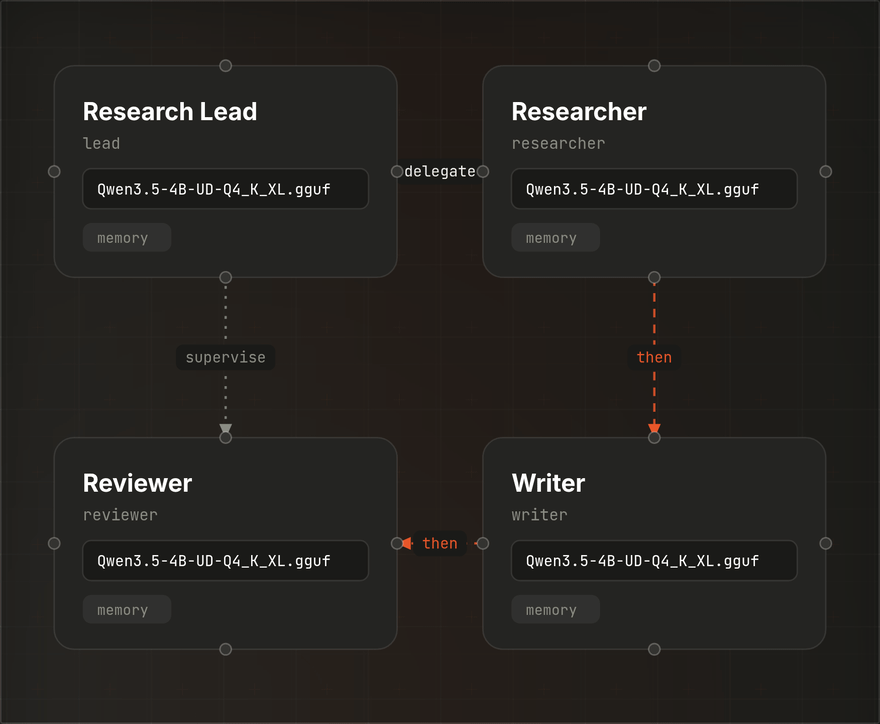

# Ensembles

Ensembles are the **recommended way to get started** with Sympozium. A Ensemble is a CRD that bundles multiple pre-configured agent personas — each with a system prompt, skills, tool policy, schedule, and memory seeds. Activating a pack is a single action: the Ensemble controller stamps out all the Kubernetes resources automatically.

## Why Ensembles?

Without Ensembles, setting up even one agent requires creating a Secret, Agent, SympoziumSchedule, and memory ConfigMap by hand. Ensembles collapse that into: pick a pack → enter your API key → done.

## How It Works

```
Ensemble "platform-team" (3 personas)
  │
  ├── Activate via TUI or Web UI (wizard → API key → confirm)
  │
  └── Controller stamps out:
      ├── Secret: platform-team-openai-key
      ├── Agent: platform-team-security-guardian
      │   ├── SympoziumSchedule: ...security-guardian-schedule (every 30m)
      │   └── ConfigMap: ...security-guardian-memory (seeded)
      ├── Agent: platform-team-sre-watchdog
      │   ├── SympoziumSchedule: ...sre-watchdog-schedule (every 5m)
      │   └── ConfigMap: ...sre-watchdog-memory (seeded)
      ├── Agent: platform-team-platform-engineer
      │   ├── SympoziumSchedule: ...platform-engineer-schedule (weekdays 9am)
      │   └── ConfigMap: ...platform-engineer-memory (seeded)
      │
      └── (if sharedMemory.enabled):
          ├── PVC: platform-team-shared-memory-db
          ├── Deployment: platform-team-shared-memory
          └── Service: platform-team-shared-memory
```

All generated resources have `ownerReferences` pointing back to the Ensemble — delete the pack and everything gets garbage-collected.

## Persona Relationships & Workflows

Ensembles support **typed relationships** between personas, enabling coordination patterns beyond independent scheduling:

<p align="center">
  
  <br><em>The four relationship types in motion: delegate, sequence, supervise, share.</em>
</p>

### Relationship Types

| Type | Behaviour | Example |
|------|-----------|---------|
| `delegation` | Source requests target, awaits result, then continues | Researcher delegates to Writer |
| `sequential` | Source must complete before target starts | Writer finishes → Reviewer begins |
| `supervision` | Source monitors target (observability only) | Lead supervises Writer and Reviewer |
| `stimulus` | Injects a pre-configured prompt into target when all agents are serving | Kickoff triggers Lead Researcher |

### Workflow Types

The `workflowType` field on a Ensemble describes the overall orchestration pattern:

| Value | Description |
|-------|-------------|
| `autonomous` | Default. Personas run independently on their own schedules. |
| `pipeline` | Personas execute in sequence defined by `sequential` edges. |
| `delegation` | Personas can actively delegate to each other at runtime. |

### Defining Relationships

```yaml
apiVersion: sympozium.ai/v1alpha1
kind: Ensemble
metadata:
  name: research-delegation-example
spec:
  workflowType: delegation
  personas:
    - name: researcher
      systemPrompt: "You are a research analyst..."
    - name: writer
      systemPrompt: "You are a technical writer..."
    - name: reviewer
      systemPrompt: "You are a quality reviewer..."
  relationships:
    - source: researcher
      target: writer
      type: delegation
      timeout: "10m"
      resultFormat: markdown
    - source: writer
      target: reviewer
      type: sequential
      timeout: "5m"
```

## Stimulus

A **Stimulus** is a lightweight configuration node that automatically injects a prompt into a target agent when all ensemble pods reach the Serving phase. It enables workflows to self-start without requiring a manual message in the feed or an external trigger.

### How It Works

1. Define a `stimulus` spec on the ensemble with a `name` and `prompt`.
2. Draw a `stimulus` relationship from the stimulus name to the target agent config.
3. When all agents in the ensemble are running (all pods reach Serving phase), the controller creates an AgentRun on the target with the configured prompt.
4. If the ensemble is disabled and re-enabled, the stimulus fires again on the next full-readiness transition.
5. The stimulus can also be manually re-triggered via the UI button or API.

### Example

```yaml
apiVersion: sympozium.ai/v1alpha1
kind: Ensemble
metadata:
  name: research-pipeline
spec:
  workflowType: pipeline
  stimulus:
    name: kickoff
    prompt: "Begin the daily research workflow. Summarize developments in AI safety from the last 24 hours."
  agentConfigs:
    - name: lead
      systemPrompt: "You are a lead researcher coordinating the team."
    - name: analyst
      systemPrompt: "You are a data analyst."
  relationships:
    - source: kickoff
      target: lead
      type: stimulus
    - source: lead
      target: analyst
      type: sequential
```

### Manual Re-trigger

The stimulus can be re-triggered at any time via the API:

```bash
curl -X POST /api/v1/ensembles/research-pipeline/stimulus/trigger
```

Or via the "Re-trigger Stimulus" button on the workflow canvas in the UI.

### Feed Integration

When a stimulus is delivered (automatically or manually), a system message appears in the feed: **"Stimulus prompt sent (readiness)"** or **"Stimulus prompt sent (manual)"**.

## Shared Workflow Memory

By default, each persona in a Ensemble has its own **private memory** — an isolated SQLite database that only that persona can access. Shared Workflow Memory adds a second, **pack-level memory pool** that all personas can read from (and optionally write to), enabling cross-persona knowledge sharing.

### Enabling Shared Memory

```yaml
apiVersion: sympozium.ai/v1alpha1
kind: Ensemble
metadata:
  name: research-delegation-example
spec:
  sharedMemory:
    enabled: true
    storageSize: "1Gi"
    accessRules:
      - persona: lead
        access: read-write
      - persona: researcher
        access: read-write
      - persona: writer
        access: read-write
      - persona: reviewer
        access: read-only
```

### How It Works

When shared memory is enabled, the Ensemble controller provisions:

- **PVC**: `<pack>-shared-memory-db` — persistent storage for the shared SQLite database
- **Deployment**: `<pack>-shared-memory` — the same `skill-memory` server image used for private memory
- **Service**: `<pack>-shared-memory` — ClusterIP service on port 8080

All resources have `ownerReferences` to the Ensemble and are cleaned up on deletion.

### Agent Tools

Agents in the pack receive three additional tools alongside their private memory tools:

| Tool | Description | Access |
|------|-------------|--------|
| `workflow_memory_search` | Search shared team knowledge contributed by any persona | All |
| `workflow_memory_store` | Store findings for other personas (auto-tagged with source persona) | read-write only |
| `workflow_memory_list` | List shared entries, filterable by persona or tag | All |

### Access Control

Each persona can be granted `read-write` or `read-only` access via `accessRules`. If no rules are specified, all personas default to `read-write`.

- **read-write**: Can search, list, and store entries
- **read-only**: Can search and list, but cannot store (the `workflow_memory_store` tool is not registered)

Access control is enforced client-side in the agent runner — sufficient because the memory server is in-cluster behind a ClusterIP with no untrusted clients.

## Synthetic Membrane

The Synthetic Membrane is an optional layer on top of Shared Workflow Memory that adds **selective permeability**, **provenance tracking**, **token budgets**, **circuit breakers**, and **time decay**. Inspired by biological cell membranes, it transforms the flat shared memory pool into a structured medium where agents share state selectively rather than broadcasting everything.

### Why a Membrane?

Without a membrane, all shared memory entries are equally visible to all personas. This works for small teams, but breaks down at scale:

- A reviewer doesn't need raw data dumps from the researcher
- Token costs grow linearly with shared state size
- A single failing delegation can cascade through the entire ensemble
- Old entries accumulate and dilute search relevance

The membrane addresses each of these with a dedicated mechanism.

### Enabling the Membrane

```yaml
apiVersion: sympozium.ai/v1alpha1
kind: Ensemble
metadata:
  name: research-delegation-example
spec:
  sharedMemory:
    enabled: true
    storageSize: "1Gi"
    membrane:
      defaultVisibility: public
      permeability:
        - agentConfig: researcher
          defaultVisibility: trusted
          exposeTags: ["findings", "data"]
          acceptTags: ["summary"]
        - agentConfig: writer
          defaultVisibility: public
          acceptTags: ["findings", "data"]
        - agentConfig: reviewer
          defaultVisibility: private
      trustGroups:
        - name: content-team
          agentConfigs: ["researcher", "writer"]
      tokenBudget:
        maxTokens: 100000
        action: halt
      circuitBreaker:
        consecutiveFailures: 3
      timeDecay:
        ttl: "168h"
        decayFunction: linear
```

### Permeability (Visibility Tiers)

Every memory entry has a **visibility** level: `public`, `trusted`, or `private`.

| Visibility | Who can see it |
|------------|---------------|
| `public` | All personas in the ensemble |
| `trusted` | Personas in the same trust group + the author |
| `private` | Only the persona that created it |

Each persona can override the ensemble default via a `permeability` rule:

- **`defaultVisibility`**: The visibility tier applied to entries this persona creates
- **`exposeTags`**: Tags this persona publishes through the membrane. Entries with other tags are treated as private.
- **`acceptTags`**: Tags this persona wants to receive. Search results are filtered to matching tags only.

### Trust Groups

Trust groups define which personas can see each other's `trusted` entries. If no trust groups are configured, trust is derived automatically from `delegation` and `supervision` relationships.

```yaml
trustGroups:
  - name: research-delegation-example
    agentConfigs: ["researcher", "writer"]
  - name: editorial
    agentConfigs: ["writer", "editor"]
```

In this example, the writer can see trusted entries from both the researcher (via `research-delegation-example`) and the editor (via `editorial`).

### Token Budget

Token budgets set a ceiling on total token consumption across all agent runs in an ensemble.

| Field | Description |
|-------|-------------|
| `maxTokens` | Maximum total tokens (input+output) across all runs. 0 = unlimited. |
| `maxTokensPerRun` | Maximum tokens for any single AgentRun. 0 = unlimited. |
| `action` | `halt` (default) — block new runs when exceeded. `warn` — allow runs but log a warning. |

When a run completes, the controller adds its token usage to `status.tokenBudgetUsed`. Before creating a new run, the controller checks whether the budget has been exceeded.

### Circuit Breaker

The circuit breaker protects against cascading delegation failures. After `consecutiveFailures` delegate children fail in a row, the circuit breaker opens and rejects further spawn requests until a delegate succeeds (which resets the counter).

```yaml
circuitBreaker:
  consecutiveFailures: 3
  cooldownDuration: "10m"  # optional
```

When the circuit breaker is open, `delegate_to_persona` calls immediately return an error instead of spawning a child run. This prevents runaway token consumption from repeated failing delegations.

### Time Decay

Time decay excludes old entries from search results without deleting them. This keeps the shared memory relevant as the team's knowledge evolves.

| Field | Description |
|-------|-------------|
| `ttl` | Entries older than this are excluded from search. Format: `"24h"`, `"168h"` (7 days). |
| `decayFunction` | `linear` (default) or `exponential` — controls how relevance decreases with age. |

### Provenance Tracking

Every memory entry tracks its **source agent** and an optional **parent ID** for derivation chains. This enables:

- **Attribution**: Which persona created this entry?
- **Lineage**: What chain of reasoning led to this conclusion?
- **Monotonic sequencing**: Entries have a `seq` number for replay and event sourcing

The memory server exposes a `/provenance?id=N` endpoint that returns the full derivation chain from root to the given entry.

### Further Reading

The membrane design is based on the [Synthetic Membrane](https://zenodo.org/records/20070699) research paper: *"The Synthetic Membrane: A Shared Permeable Boundary for Multi-Agent AI Systems"* (April 2026). The paper proposes a six-layer architecture for multi-agent coordination, drawing on biological analogues, distributed systems theory, and recent findings from the Superminds Test (2M+ agents, zero collective intelligence without structured substrate).

### Auto-Context Injection

When an agent starts, the runner automatically queries both private and shared memory for task-relevant context. The system prompt includes two sections:

- **Your Past Findings (Private Memory)** — from the persona's own memory
- **Team Knowledge (Shared Workflow Memory)** — from the pack's shared pool

### Attribution

Entries stored via `workflow_memory_store` are automatically tagged with the source persona's instance name. This enables filtering by persona (e.g., "show me what the researcher found") without relying on agents to self-tag correctly.

### delegate_to_persona Tool

Agents that belong to a Ensemble automatically receive the `delegate_to_persona` tool. This allows an agent to delegate a task to another persona in the same pack:

```
Tool: delegate_to_persona
Arguments:
  targetPersona: "writer"
  task: "Write a report based on these findings: ..."
```

The tool is **blocking** — the parent agent waits (up to 10 minutes) for the child to complete and receives the result directly. Under the hood, the tool writes a spawn request to `/ipc/spawn/`, the SpawnRouter creates a child AgentRun via the Spawner (validating the relationship edge exists), and when the child finishes, the SpawnRouter delivers the result back through NATS to the parent's IPC bridge. The parent's `DelegateStatus` is populated with the child run name, target persona, phase, and result. During the wait, the parent AgentRun transitions to `AwaitingDelegate` phase (timeout checking is paused).

### Visual Canvas

The Web UI provides two canvas views for visualising persona relationships:

- **Per-pack canvas** (Persona detail page → Workflow tab): editable — drag to connect personas, pick relationship type, save back to the CRD
- **Global canvas** (Ensembles list page → Canvas view): read-only — shows all enabled packs together with live run status
- **Dashboard widget** (Team Canvas panel): compact view with pack selector dropdown and live run status highlighting

<p align="center">
  
  <br><em>The workflow canvas: drag-to-connect personas, pick a relationship type, save to the CRD.</em>
</p>

Persona nodes show live run status with animated indicators:

- **Running**: pulsing blue ring + task preview
- **Serving**: pulsing violet ring
- **AwaitingDelegate**: pulsing amber ring
- **Failed**: red ring
- **Succeeded**: green ring

## Built-in Packs

| Pack | Category | Agents | Description |
|------|----------|--------|-------------|
| `platform-team` | Platform | Security Guardian, SRE Watchdog, Platform Engineer | Core platform engineering — security audits, cluster health, manifest review |
| `devops-pipeline-example` | DevOps | Incident Responder, Cost Analyzer | DevOps workflows — incident triage, resource right-sizing |
| `developer-team` | Development | Tech Lead, Backend Dev, Frontend Dev, QA Engineer, Code Reviewer, DevOps Engineer, Docs Writer | A 2-pizza software development team that collaborates on a single GitHub repository |
| `research-delegation-example` | Research | Lead, Researcher, Writer, Reviewer | A coordinated research and reporting team demonstrating delegation, sequential, and supervision relationships |
| `observability-mcp-example` | Observability | Grafana Analyst, Log Investigator | Observability workflows using MCP servers for Grafana and Loki |

## Activating a Pack in the Web UI

1. Navigate to **Ensembles** in the sidebar
2. Click **Enable** on a pack to open the onboarding wizard
3. Choose your AI provider and paste an API key
4. Optionally bind channels (Telegram, Slack, Discord, WhatsApp)
5. Confirm — the controller creates all instances within seconds

## Activating via kubectl

```yaml
# 1. Create the provider secret
kubectl create secret generic my-pack-openai-key \
  --from-literal=OPENAI_API_KEY=sk-...

# 2. Patch the Ensemble with authRefs to trigger activation
kubectl patch ensemble platform-team --type=merge -p '{
  "spec": {
    "authRefs": [{"provider": "openai", "secret": "my-pack-openai-key"}]
  }
}'
```

The controller detects the `authRefs` change and reconciles — creating Agents, Schedules, and memory ConfigMaps for each persona.

## Writing Your Own Ensemble

```yaml
apiVersion: sympozium.ai/v1alpha1
kind: Ensemble
metadata:
  name: my-team
spec:
  description: "My custom agent team"
  category: custom
  version: "1.0.0"
  workflowType: delegation
  personas:
    - name: planner
      displayName: "Planner"
      systemPrompt: |
        You plan work and delegate to the executor.
      skills:
        - k8s-ops
        - memory
      schedule:
        type: heartbeat
        interval: "1h"
        task: "Check for pending work and delegate to the executor."
    - name: executor
      displayName: "Executor"
      systemPrompt: |
        You execute tasks assigned by the planner.
      skills:
        - k8s-ops
        - memory
  relationships:
    - source: planner
      target: executor
      type: delegation
      timeout: "15m"
```

Apply it with `kubectl apply -f my-team.yaml`, then activate through the Web UI or TUI.

!!! tip
    See the [Developer Team Pack](../skills/developer-team.md) for a detailed example of a complex Ensemble with seven collaborating agents.
