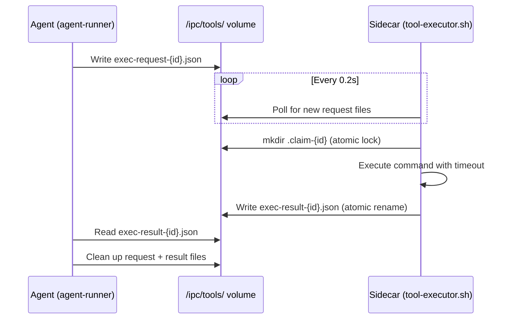

# Writing Custom Sidecars

This guide explains how to build custom sidecar containers that process tool calls from Sympozium agents. If you just need to give an agent access to CLI tools like `kubectl` or `helm`, the [Writing Skills](writing-skills.md) guide covers that. This guide is for when you need **custom logic** — a database client, an API wrapper, a domain-specific computation engine — running in its own container.

---

## Concepts

When an agent calls the `execute_command` tool, the command doesn't run inside the agent container. Instead, the agent and sidecar communicate through a **file-based IPC protocol** on a shared `/ipc` volume:

```
┌─────────────────────────────────────────────────────────────┐
│  Agent Pod                                                   │
│                                                              │
│  ┌──────────────┐   /ipc/tools/    ┌─────────────────────┐  │
│  │ agent-runner  │──exec-request──→│  your sidecar       │  │
│  │               │←──exec-result── │  (tool-executor.sh) │  │
│  └──────────────┘                  └─────────────────────┘  │
│         │                                                    │
│         │  shared /ipc volume (emptyDir)                     │
│         │  shared /workspace volume                          │
└─────────────────────────────────────────────────────────────┘
```

There are no TCP ports or HTTP servers involved. The entire protocol is JSON files on a shared filesystem.

---

## The IPC Protocol

### Request

The agent writes a request file to `/ipc/tools/exec-request-{id}.json`:

```json
{
  "id": "1718100000000000000",
  "command": "node /app/dist/cli.js analyze",
  "args": [],
  "workDir": "/workspace",
  "timeout": 30,
  "target": "my-skill"
}
```

| Field | Type | Required | Description |
|-------|------|----------|-------------|
| `id` | string | yes | Unique request ID (nanosecond timestamp) |
| `command` | string | yes\* | Shell command to execute (shell mode) |
| `args` | string[] | no | Additional arguments appended to command (shell mode) |
| `argv` | string[] | no | Argument vector executed **without a shell** (argv mode — see below) |
| `stdin` | string | no | Payload piped to the process stdin in argv mode |
| `workDir` | string | no | Working directory (default: `/workspace`) |
| `timeout` | int | no | Timeout in seconds, 1–120 (default: 30) |
| `target` | string | no | SkillPack name for routing (see [Target-Based Routing](#target-based-routing)) |

\* `command` is required in **shell mode**. When `argv` is a non-empty array the request is in **argv mode** and `command`/`args` are ignored.

**Shell mode vs argv mode.** `execute_command` uses shell mode: `command` (plus `args`) is run under `bash -c`, so pipes, globs, and redirects work. [Native sidecar tools](#native-sidecar-tools) use argv mode: `argv` is executed directly as an argument vector with no shell, so argument *values* can never inject shell syntax. Optional `stdin` is piped to the process. The `tool-executor.sh` in this guide supports both — it switches to argv mode whenever `argv` is present.

### Response

The sidecar writes a result file to `/ipc/tools/exec-result-{id}.json`:

```json
{
  "id": "1718100000000000000",
  "exitCode": 0,
  "stdout": "Analysis complete: 3 issues found.",
  "stderr": "",
  "timedOut": false
}
```

| Field | Type | Description |
|-------|------|-------------|
| `id` | string | Matches the request ID |
| `exitCode` | int | Command exit code (0 = success) |
| `stdout` | string | Standard output (truncated at 50KB) |
| `stderr` | string | Standard error (truncated at 50KB) |
| `timedOut` | bool | `true` if the command exceeded `timeout` seconds |

### Lifecycle



Key details:

- **Claiming**: The sidecar creates a directory `/ipc/tools/.claim-{id}` before processing. Since `mkdir` is atomic on POSIX filesystems, only one sidecar wins in multi-sidecar pods.
- **Atomic writes**: Results are written to a `.tmp` file first, then renamed with `mv` — the agent never reads a partial file.
- **Termination**: When the agent run completes, it creates `/ipc/done`. The sidecar exits when it detects this file.

---

## Building a Sidecar Image

A sidecar needs two things: your application logic, and `tool-executor.sh` to bridge the IPC protocol.

### Step 1: The tool executor

Copy the standard `tool-executor.sh` into your image. This script handles polling, request parsing, claiming, timeout enforcement, and response writing — you don't need to implement the IPC protocol yourself.

Here's a minimal version:

```bash
#!/bin/bash
set -euo pipefail

TOOLS_DIR="/ipc/tools"
POLL_INTERVAL=0.2

mkdir -p "$TOOLS_DIR"
echo "[tool-executor] started, watching $TOOLS_DIR"

process_request() {
    local req_file="$1"
    local id
    id="$(basename "$req_file" .json)"
    id="${id#exec-request-}"

    local result_file="$TOOLS_DIR/exec-result-${id}.json"

    local command workdir timeout_sec
    command=$(jq -r '.command // ""' "$req_file")
    workdir=$(jq -r '.workDir // "/workspace"' "$req_file")
    timeout_sec=$(jq -r '.timeout // 30' "$req_file")

    if [[ "$timeout_sec" -lt 1 ]]; then timeout_sec=30; fi
    if [[ "$timeout_sec" -gt 120 ]]; then timeout_sec=120; fi

    local stdout="" stderr="" exit_code=0 timed_out="false"
    local tmp_out=$(mktemp) tmp_err=$(mktemp)

    cd "$workdir" 2>/dev/null || cd /

    if timeout "$timeout_sec" bash -c "$command" >"$tmp_out" 2>"$tmp_err"; then
        exit_code=0
    else
        exit_code=$?
        [[ $exit_code -eq 124 ]] && timed_out="true"
    fi

    stdout=$(head -c 51200 "$tmp_out")
    stderr=$(head -c 51200 "$tmp_err")
    rm -f "$tmp_out" "$tmp_err"

    local tmp_result="${result_file}.tmp"
    jq -n \
        --arg id "$id" \
        --argjson exitCode "$exit_code" \
        --arg stdout "$stdout" \
        --arg stderr "$stderr" \
        --argjson timedOut "$timed_out" \
        '{id: $id, exitCode: $exitCode, stdout: $stdout, stderr: $stderr, timedOut: $timedOut}' \
        > "$tmp_result"
    mv "$tmp_result" "$result_file"
}

while true; do
    [[ -f /ipc/done ]] && exit 0

    for req_file in "$TOOLS_DIR"/exec-request-*.json; do
        [[ -e "$req_file" ]] || continue

        local_id="$(basename "$req_file" .json)"
        local_id="${local_id#exec-request-}"

        [[ -e "$TOOLS_DIR/exec-result-${local_id}.json" ]] && continue

        # Target routing
        if [[ -n "${SYMPOZIUM_SKILL_PACK:-}" ]]; then
            req_target=$(jq -r '.target // ""' "$req_file" 2>/dev/null || echo "")
            req_target=$(printf '%s' "$req_target" | tr '[:upper:]' '[:lower:]' | tr -d '[:space:]')
            self=$(printf '%s' "$SYMPOZIUM_SKILL_PACK" | tr '[:upper:]' '[:lower:]' | tr -d '[:space:]')
            [[ -n "$req_target" && "$req_target" != "$self" ]] && continue
        fi

        mkdir "$TOOLS_DIR/.claim-${local_id}" 2>/dev/null || continue
        process_request "$req_file" &
    done

    sleep "$POLL_INTERVAL"
done
```

### Step 2: Dockerfile

```dockerfile
FROM node:22-alpine AS build
WORKDIR /app
COPY package.json package-lock.json ./
RUN npm ci --production=false
COPY tsconfig.json ./
COPY src/ src/
RUN npx tsc

FROM node:22-alpine
RUN apk add --no-cache bash jq coreutils \
    && adduser -D -u 1000 agent
WORKDIR /app
COPY --from=build /app/dist/ dist/
COPY --from=build /app/node_modules/ node_modules/
COPY --from=build /app/package.json .
COPY tool-executor.sh /usr/local/bin/tool-executor.sh
RUN chmod +x /usr/local/bin/tool-executor.sh

USER 1000
WORKDIR /workspace
CMD ["/usr/local/bin/tool-executor.sh"]
```

!!! warning "Required packages"
    Your sidecar image **must** include `bash`, `jq`, and `coreutils` for `tool-executor.sh` to work. The image must run as UID 1000 (`runAsNonRoot: true` is enforced).

### Step 3: Build and push

```bash
docker build -t ghcr.io/yourorg/my-sidecar:latest .
docker push ghcr.io/yourorg/my-sidecar:latest
```

---

## Registering in a SkillPack

Add the sidecar to your SkillPack CRD under `spec.sidecar`:

```yaml
apiVersion: sympozium.ai/v1alpha1
kind: SkillPack
metadata:
  name: my-analysis
spec:
  category: devops
  version: "0.1.0"
  source: custom
  skills:
    - name: analyze
      description: Run custom analysis on cluster resources
      content: |
        # Analysis Tool

        Use `execute_command` to run analysis:
        ```
        node /app/dist/cli.js analyze --input /workspace/data.json
        ```

        The tool outputs JSON to stdout. Parse and summarise the results.
      requires:
        tools:
          - bash

  sidecar:
    image: ghcr.io/yourorg/my-sidecar:latest
    mountWorkspace: true
    resources:
      cpu: "200m"
      memory: "256Mi"
```

### Sidecar fields

| Field | Type | Default | Description |
|-------|------|---------|-------------|
| `image` | string | — | Container image reference (required) |
| `imagePullPolicy` | string | — | Kubernetes pull policy |
| `command` | string[] | — | Override container entrypoint |
| `env` | EnvVar[] | — | Additional environment variables |
| `mountWorkspace` | bool | `false` | Mount the shared `/workspace` volume |
| `resources.cpu` | string | — | CPU request/limit |
| `resources.memory` | string | — | Memory request/limit |
| `secretRef` | string | — | Kubernetes Secret to mount |
| `secretMountPath` | string | `/secrets/{secretRef}` | Where to mount the secret |
| `volumes` | Volume[] | — | Additional Kubernetes volumes |
| `volumeMounts` | VolumeMount[] | — | Additional mount points |
| `rbac` | RBACRule[] | — | Namespace-scoped RBAC rules |
| `clusterRBAC` | RBACRule[] | — | Cluster-wide RBAC rules |
| `hostAccess` | object | — | Host namespace/path access (advanced) |
| `tools` | SidecarTool[] | — | [Native function-calling tools](#native-sidecar-tools) exposed to the LLM |

### Environment variables

The runtime automatically sets `SYMPOZIUM_SKILL_PACK` on each sidecar container to the SkillPack's `metadata.name`. This is used for [target-based routing](#target-based-routing).

Your SkillPack can inject additional env vars:

```yaml
sidecar:
  env:
    - name: API_URL
      value: "https://api.example.com"
```

### Secrets

Mount Kubernetes Secrets for credentials:

```yaml
sidecar:
  secretRef: my-api-key
  secretMountPath: /secrets/my-api-key
```

Each key in the Secret becomes a file under the mount path. Read them in your application:

```bash
export API_KEY=$(cat /secrets/my-api-key/API_KEY)
```

### Persistent volumes

For sidecars that need durable state (databases, caches):

```yaml
sidecar:
  volumes:
    - name: my-data
      persistentVolumeClaim:
        claimName: my-data-pvc
  volumeMounts:
    - name: my-data
      mountPath: /data
```

---

## Native Sidecar Tools

By default the agent reaches a sidecar through `execute_command`, where the LLM has to construct a shell command string (`execute_command(target="my-skill", command="node /app/dist/cli.js evaluate ...")`). Smaller and non-Anthropic models often get that quoting wrong. **Native sidecar tools** instead expose your sidecar's operations to the model as typed, function-calling tools with a JSON Schema — the model just fills in structured arguments.

Declare them under `sidecar.tools` on the SkillPack:

```yaml
sidecar:
  image: ghcr.io/acme/service-discovery:latest
  tools:
    - name: sd_evaluate_changes          # snake_case, unique across all tools
      description: "Evaluate proposed changes for a service against the catalog."
      exec: ["node", "/app/dist/cli.js"] # the executable argv prefix
      subcommand: evaluate-changes        # appended after exec
      inputMode: stdin                    # "args" (default) or "stdin"
      positionalArgs: ["serviceIdentifier"]
      parameters:                         # JSON Schema handed to the model
        type: object
        properties:
          serviceIdentifier: { type: string }
          catalog: { type: object }
        required: [serviceIdentifier]
```

With this, the model calls `sd_evaluate_changes({serviceIdentifier: "web", catalog: {...}})` and the runtime runs `node /app/dist/cli.js evaluate-changes web` with `{"catalog": {...}}` on stdin.

### Tool fields

| Field | Type | Default | Description |
|-------|------|---------|-------------|
| `name` | string | — | Tool name shown to the LLM. Must match `^[a-z][a-z0-9_]*$` and be unique across built-in, MCP, and all sidecar tools |
| `description` | string | — | What the tool does / when to use it |
| `exec` | string[] | — | Argument vector prefix to run (e.g. `["node", "/app/dist/cli.js"]`). Required, at least one element |
| `subcommand` | string | — | Fixed sub-command appended after `exec` |
| `inputMode` | string | `args` | `args` passes parameters as positional CLI args; `stdin` pipes the non-positional parameters as a JSON object on stdin |
| `positionalArgs` | string[] | — | Parameter names (in order) passed as positional CLI arguments. Each must be declared in `parameters` |
| `parameters` | object | `{}` | JSON Schema (type `object`) describing the arguments, handed to the model verbatim |

### How it stays secure

This is deliberately not "the sidecar drops a tool manifest the agent reads." The definitions live on the SkillPack CRD, which means:

- **Operator-controlled, not agent-controlled.** The controller serializes the declared tools into a ConfigMap and mounts it **read-only** (and immutable) into the agent container (at `/config/sidecar-tools`). The running agent consumes the manifest but cannot forge or alter it.
- **The executable is declared here**, not supplied by the model. `exec` is operator-authored on the SkillPack and is what actually runs — the agent never chooses the binary. (Admission currently only requires `exec` to be non-empty; a binary allowlist via `SympoziumPolicy` may be added in a future phase.)
- **Admission-validated.** The validating webhook rejects malformed names, collisions with built-in/memory tools, duplicate names across SkillPacks, `positionalArgs` that don't reference a *required* declared parameter, and `inputMode: args` tools that declare non-positional parameters (which would be silently dropped).
- **No more authority than `execute_command`.** Dispatch flows through the same gated exec IPC, targeting this sidecar. Arguments are delivered in [argv mode](#the-ipc-protocol) (no shell), so a value like `"; rm -rf /"` or one containing newlines is passed as exactly one literal argument and never interpreted.

!!! warning "Two things to know when authoring a tool"
    - **Flag injection.** A model-supplied positional value beginning with `-` is still passed to your binary, which may interpret it as a flag (e.g. `--kubeconfig=...`). This is no broader than `execute_command`'s existing authority, but design your CLI to treat positionals as operands — honor a `--` end-of-options marker, or validate/whitelist values — rather than trusting them as plain operands.
    - **Minimum executor version.** Native tools dispatch in argv mode, which requires the argv-aware `tool-executor.sh` shown in this guide. An older sidecar image without the argv branch will receive the request but do nothing useful — rebuild your sidecar against the current executor before declaring tools.

Your sidecar needs no extra code beyond the `tool-executor.sh` shown above — it already handles argv-mode requests.

---

## Target-Based Routing

When an agent pod has **multiple skill sidecars**, the `target` field in the request routes commands to the correct sidecar.

The agent-runner sets `target` to the SkillPack name associated with the skill being used. Each sidecar's `tool-executor.sh` compares this against its own `SYMPOZIUM_SKILL_PACK` environment variable:

```
Agent: execute_command(command="node /app/cli.js analyze", target="my-analysis")

┌────────────────────┐
│ sidecar: k8s-ops   │  SYMPOZIUM_SKILL_PACK=k8s-ops     → skip (target mismatch)
├────────────────────┤
│ sidecar: my-analysis│  SYMPOZIUM_SKILL_PACK=my-analysis → claim and execute ✓
└────────────────────┘
```

Comparison is **case-insensitive** and **whitespace-trimmed**. An empty `target` means any sidecar can claim the request (legacy behavior).

---

## Working Example: Echo Sidecar

A complete minimal sidecar that echoes commands back, useful as a starting template.

### Dockerfile

```dockerfile
FROM alpine:3.20
RUN apk add --no-cache bash jq coreutils \
    && adduser -D -u 1000 agent
COPY tool-executor.sh /usr/local/bin/tool-executor.sh
RUN chmod +x /usr/local/bin/tool-executor.sh
USER 1000
WORKDIR /workspace
CMD ["/usr/local/bin/tool-executor.sh"]
```

### SkillPack

```yaml
apiVersion: sympozium.ai/v1alpha1
kind: SkillPack
metadata:
  name: echo-demo
spec:
  category: devops
  version: "0.1.0"
  source: custom
  skills:
    - name: echo
      description: Echo commands for testing sidecar connectivity
      content: |
        # Echo Demo
        Run commands using `execute_command`. They execute in the echo sidecar.
        Try: `echo "Hello from sidecar!"`
  sidecar:
    image: ghcr.io/yourorg/echo-sidecar:latest
    mountWorkspace: true
    resources:
      cpu: "100m"
      memory: "128Mi"
```

### Test it

```bash
# Toggle the skill on an agent
kubectl patch agent my-agent --type=merge \
  -p '{"spec":{"skills":[{"skillPackRef":"echo-demo"}]}}'

# Create a test run
kubectl apply -f - <<EOF
apiVersion: sympozium.ai/v1alpha1
kind: AgentRun
metadata:
  name: test-echo
spec:
  agentRef: my-agent
  agentId: primary
  sessionKey: test-echo-1
  task: "Run: echo 'Hello from sidecar!' and tell me what happened."
  model:
    provider: openai
    model: gpt-4o-mini
    authSecretRef: my-agent-openai-key
EOF

# Check the result
kubectl get agentrun test-echo -o jsonpath='{.status.result}'
```

---

## Troubleshooting

| Symptom | Check |
|---------|-------|
| "timed out waiting for command execution result" | Sidecar not running. Check `kubectl logs <pod> -c skill-<name>` |
| Command runs but wrong sidecar picks it up | Verify `target` field matches `SYMPOZIUM_SKILL_PACK`. Check for typos or casing issues |
| Sidecar crashes on startup | Image must run as UID 1000. Verify `bash`, `jq`, and `coreutils` are installed |
| Result is truncated | stdout/stderr are capped at 50KB each. Write large outputs to `/workspace` and use `read_file` instead |
| Sidecar exits immediately | The main process must stay alive. Use `tool-executor.sh` as CMD, not `sleep infinity` (unless your sidecar only needs passive file access) |
| Permission denied on `/ipc` | The `/ipc` volume is an `emptyDir` injected by the controller — verify your SkillPack is being resolved correctly |

---

## Learn More

- [Writing Skills](writing-skills.md) — SkillPack CRD structure, RBAC, host access
- [Writing Tools](writing-tools.md) — how tools work on the agent side
- [Skills & Sidecars](../concepts/skills.md) — architecture overview
