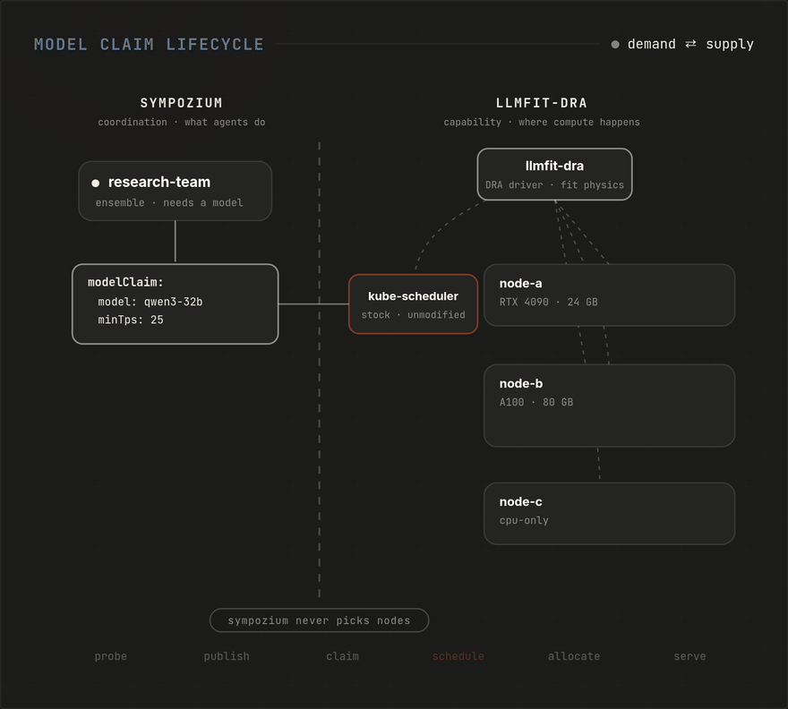

# Positioning: what Sympozium is (and deliberately is not)

Sympozium is a **coordination layer for multi-agent AI systems on Kubernetes**.
That is the whole product. This page exists because AI infrastructure is a
crowded, blurry space, and the fastest way to stay coherent is to write the
boundary down and hold every feature to it.

## The three layers

AI systems on Kubernetes decompose into three layers with three different
jobs. Sympozium is exactly one of them.

| Layer | Owns | Decides |
|-------|------|---------|
| **Sympozium** — coordination | Agents: identity, execution, policy, membrane, ensembles, memory | What agents **do** |
| **[llmfit-dra](https://github.com/sympozium-ai/llmfit-dra)** — capability | Accelerator inventory, fit physics, claims, placement | Where compute **happens** |
| **Serving engines** (vLLM, SGLang, llama.cpp) | Batching, KV cache, disaggregation runtime | How tokens **move** |

## The boundary test

For any proposed feature, ask one question: *does it decide what agents do,
where compute happens, or how tokens move?*

One question, one home. If the answer is not "what agents do", the feature
belongs in another layer — even if Sympozium could technically host it.

## Models are claimed, not placed

Agents need model endpoints. Historically Sympozium grew its own placement
machinery to provide them — node telemetry caches, best-node selection,
hostname pinning. That machinery is being retired: placement moves to
[llmfit-dra](https://github.com/sympozium-ai/llmfit-dra), a Kubernetes DRA
driver that publishes what each accelerator *can do* and lets the **stock
kube-scheduler** place workloads against physics ("this model at 20 tok/s"),
with exclusive allocation and explainable failures.

<p align="center">
  
  <br><em>The claim lifecycle: probe → publish → claim → schedule → allocate → serve.
  Sympozium never picks nodes — the claim is the only thing that crosses the boundary.</em>
</p>

The analogy that makes this precise: **a ModelClaim is to llmfit-dra what a
PersistentVolumeClaim is to a CSI driver.** No one calls an application "a
storage product" because its chart contains a `volumeClaimTemplate`. In the
same way, an Ensemble persona declaring

```yaml
modelClaim:
  model: Qwen/Qwen2.5-32B-Instruct
  minTps: 25
```

does not make Sympozium a placement engine. Sympozium governs *whether and
what* an agent may claim (policy, budgets, quotas); the capability layer
decides *whether and where* the claim is satisfiable. Demand and supply,
meeting at the claim.

## What Sympozium is not

- **Not a model-serving platform.** If you want to serve models without
  agents, you don't need Sympozium: use llmfit-dra plus a serving engine
  directly. Sympozium's Model resource exists to give *personas* endpoints,
  not as a general serving product.
- **Not a placement engine.** Sympozium never decides which node or device a
  model runs on. It expresses requirements; the scheduler satisfies them.
- **Not an inference runtime or gateway.** Disaggregated prefill/decode,
  KV-cache transfer, batching strategy — that is the serving layer's job.
  llmfit-dra places the *pools* (its claims can distinguish prefill-grade
  from decode-grade silicon); the engine moves the tokens; a Sympozium
  persona just sees one endpoint.

## Consequences already scheduled

Two existing subsystems fail the boundary test and are being migrated, not
grown:

- **node-probe** (host inference discovery) is capability inventory — it
  belongs in the supply layer and will move out of Sympozium.
- **The density dashboard** remains as screens, but post-migration it is a
  read-only view of llmfit-dra's published inventory, not a Sympozium
  subsystem.

The full migration map lives in the llmfit-dra repo
([sympozium-integration design](https://github.com/sympozium-ai/llmfit-dra/tree/main/docs/design)).

## The one-liners

- **Sympozium**: a coordination layer for multi-agent AI systems on
  Kubernetes. Agents are Pods, policy is CRDs — and when an agent needs a
  model, it *claims* one; Sympozium never decides where it runs.
- **llmfit-dra**: ask for a model instead of a device — capability inventory
  and physics-based placement for heterogeneous accelerators, through the
  stock scheduler.
